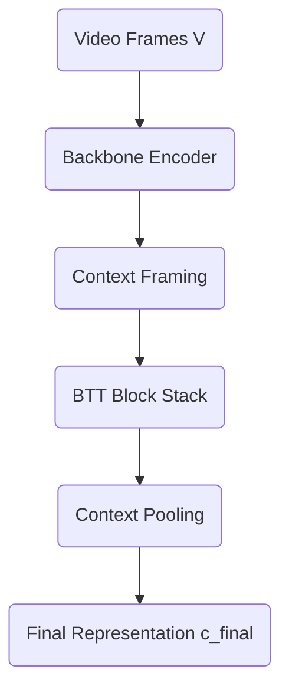
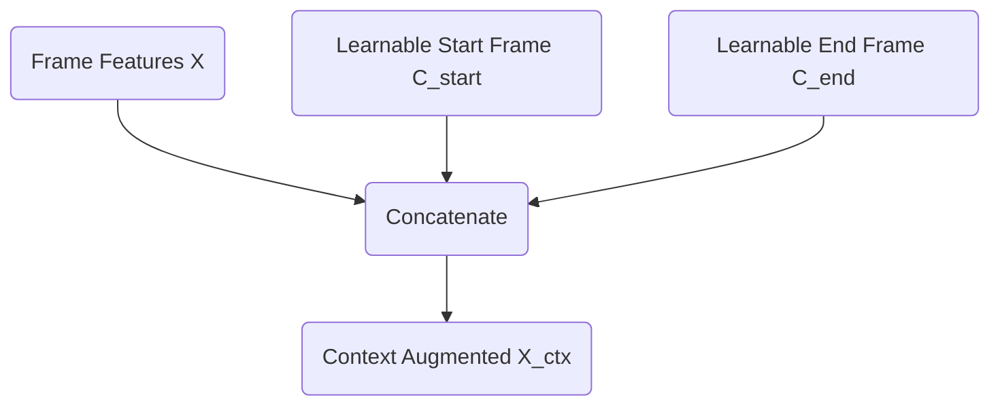
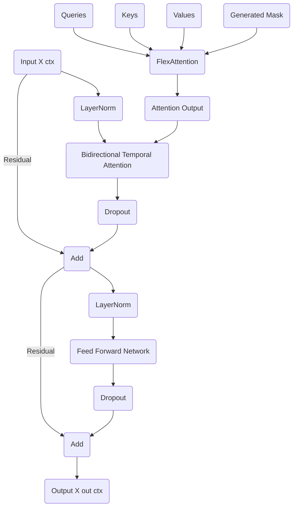
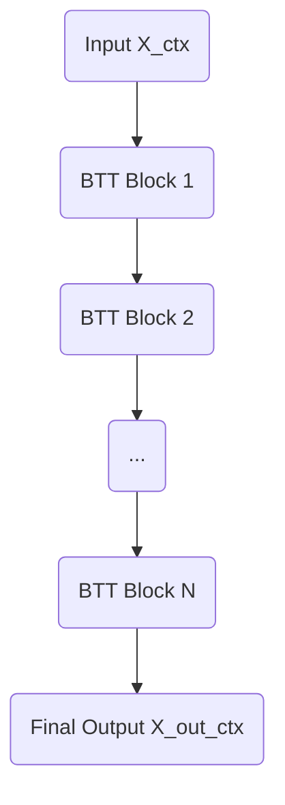

# Research Paper Proposal: Spool

**Title:** Spool: Efficient Video Understanding via Bidirectional Temporal Attention with Context Framing

**1. Abstract**

Video understanding requires modeling complex spatio-temporal dynamics, often over extended durations. While 3D CNNs capture local patterns and Transformers offer powerful sequence modeling, achieving both efficiency and effective long-range temporal reasoning remains challenging. Existing methods often struggle with quadratic complexity, limited receptive fields, or unidirectional biases. We propose Spool, a novel video understanding architecture featuring a Bidirectional Temporal Transformer. Spool leverages strong pre-trained foundation models (e.g., DINOv2) for per-frame feature extraction. Crucially, it introduces dedicated learnable Context Frames prepended and appended to the sequence of frame features. The core of Spool is a stack of Bidirectional Temporal Transformer (BTT) blocks employing an optimized attention mechanism (`flex_attention`) with distinct, configurable groups of lookahead and lookback attention heads operating within a constrained local temporal window. Context frames participate in attention, allowing efficient integration of global sequence information with local dynamics. This design enables Spool to model both past and future context efficiently within each layer, maintaining linear complexity with respect to sequence length. We hypothesize that Spool will achieve competitive performance on standard action recognition benchmarks (e.g., Kinetics, HMDB51, UCF101) while offering significant computational advantages over methods relying on full spatio-temporal attention.

**2. Introduction**

Understanding dynamic scenes in videos is a fundamental challenge in computer vision, with applications ranging from action recognition to autonomous driving. Early approaches relied on 3D Convolutional Neural Networks (CNNs) (Tran et al., 2015; Carreira & Zisserman, 2017) or combined 2D CNNs with Recurrent Neural Networks (RNNs) (Donahue et al., 2015). While effective to some extent, 3D CNNs can be computationally expensive and have limited temporal receptive fields, while RNNs often struggle with long-range dependencies and parallelization.

The success of Transformers (Vaswani et al., 2017) in sequence modeling led to their adaptation for video (Arnab et al., 2021; Bertasius et al., 2021). However, applying full spatio-temporal self-attention incurs cubic complexity, limiting scalability. Factorized approaches (e.g., spatial-then-temporal attention) reduce cost but may compromise modeling capacity. Windowed attention mechanisms improve efficiency but often rely on multiple layers to propagate information globally.

We identify a need for architectures that explicitly and efficiently model bidirectional temporal dependencies while integrating global context within a unified framework. We propose Spool, characterized by:

1.  **Foundation Model Backbone:** Utilizes powerful pre-trained image models (e.g., DINOv2 - Oquab et al., 2023) as a frozen or fine-tuned `Backbone Frame Encoder` to extract rich spatial features for each frame.
2.  **Context Framing Module:** Prepends and appends learnable "CLS" frames to the sequence of frame features. These act as boundary representations, facilitating interaction between local frame features and global sequence context via the attention mechanism.
3.  **Bidirectional Temporal Transformer (BTT) Block:** Employs a novel `Bidirectional Temporal Attention` mechanism. This mechanism features distinct groups of attention heads dedicated to looking backward (past context) and looking forward (future context) within a defined local temporal window (`local_frame_range`). The context frames are attended to by all heads, providing a pathway for global information. This uses an optimized kernel (`flex_attention`) for efficiency.
4.  **Context Pooling:** Derives a final sequence-level representation by pooling information from the boundary context frames after temporal processing.

Spool aims to efficiently capture both short-range motion dynamics via local temporal attention and long-range dependencies via the interaction with context frames, all within a bidirectional framework. Its linear complexity w.r.t. sequence length makes it suitable for longer videos.

**Our key contributions are:**

1.  **Bidirectional Temporal Attention:** A novel attention mechanism with distinct lookahead/lookback head groups and local temporal constraints for efficient video modeling.
2.  **Context Framing:** A method using learnable boundary frames to integrate global sequence information efficiently via attention.
3.  **Spool Architecture:** An efficient video transformer backbone combining a strong visual encoder, context framing, and bidirectional temporal attention blocks.
4.  **Empirical Validation:** Planned experiments on standard action recognition benchmarks to demonstrate Spool's effectiveness and efficiency compared to state-of-the-art methods.

**3. Related Work**

*   **3D CNNs:** C3D (Tran et al., 2015), I3D (Carreira & Zisserman, 2017), SlowFast (Feichtenhofer et al., 2019). Capture local spatio-temporal features but computationally heavy and limited temporal range.
*   **CNN+RNN:** LRCN (Donahue et al., 2015). Often struggles with long dependencies.
*   **Video Transformers:**
    *   *ViViT:* Factorized spatial and temporal attention (Arnab et al., 2021).
    *   *TimeSformer:* Factorized space-time attention (Bertasius et al., 2021).
    *   *MViT:* Multi-scale attention (Fan et al., 2021). Spool differs with explicit bidirectional heads and context frames.
    *   *VideoMAE:* Masked autoencoding pre-training (Tong et al., 2022). Focuses on pre-training; Spool is an architecture applicable with various pre-training.
*   **Foundation Models in Vision:** ViT (Dosovitskiy et al., 2020), DINO/DINOv2 (Caron et al., 2021; Oquab et al., 2023). Spool leverages these as powerful frame feature extractors.
*   **Attention Mechanisms:** Local attention, windowed attention (e.g., Swin - Liu et al., 2021). Spool uses masked attention but with specific bidirectional structure and context frame interaction. `flex_attention` provides an efficient implementation.
*   **CLS Tokens:** Used in BERT (Devlin et al., 2018) and ViT for global representation. Spool uses *boundary* CLS *frames* specifically for bidirectional context integration.

Spool distinguishes itself through its explicit bidirectional temporal attention design combined with learnable context frames for efficient global-local interaction, built upon strong foundation model features.

**4. Proposed Method: Spool**

The Spool architecture processes a sequence of video frames $ V = [f_1, f_2, ..., f_T] $.

**4.1. Backbone Frame Encoder**

*   Takes raw video frames $V$ as input.
*   Uses a pre-trained image foundation model (e.g., DINOv2) to extract patch embeddings for each frame.
*   Outputs a sequence of frame features: $ X = [x_1, x_2, ..., x_T] $, where each $ x_t \in \mathbb{R}^{L \times D} $ (L = patches/tokens per frame, D = embedding dimension). Shape: (B, T, L, D).

**4.2. Context Framing Module**

*   Takes frame features $X$ as input.
*   Prepends a learnable start context frame $ C_{start} \in \mathbb{R}^{L \times D} $ and appends a learnable end context frame $ C_{end} \in \mathbb{R}^{L \times D} $. These parameters are shared across the batch but expanded.
*   Outputs the context-augmented sequence: $ X_{ctx} = [C_{start}, x_1, ..., x_T, C_{end}] $. Shape: (B, T+2, L, D).

**4.3. Bidirectional Temporal Transformer (BTT) Block**

*   Forms the core temporal modeling component, applied iteratively.
*   Input: Sequence tensor from the previous layer (initially $ X_{ctx} $). Shape: (B, T+2, L, D).
*   **Pre-LayerNorm:** Standard normalization.
*   **Bidirectional Temporal Attention:**
    *   Applies multi-head self-attention using an optimized kernel (`flex_attention`).
    *   Heads are partitioned into `num_lookback_heads` and `num_lookahead_heads`.
    *   **Masking:** An attention mask is generated (and cached) to enforce locality and bidirectionality:
        *   Lookback heads: Attend to the current frame, preceding frames within `local_frame_range`, and the start context frame $C_{start}$.
        *   Lookahead heads: Attend to the current frame, succeeding frames within `local_frame_range`, and the end context frame $C_{end}$.
        *   Context frames $C_{start}$ and $C_{end}$ attend to relevant local frames and each other based on head type (lookback heads use $C_{start}$ more, lookahead use $C_{end}$ more, details depend on precise mask implementation like in `attention.py`).
    *   The unified QKV projection is used, and attention is computed efficiently via `flex_attention` with the generated block mask.
*   **Residual Connection & Dropout.**
*   **Pre-LayerNorm & Feed-Forward Network (FFN).**
*   **Residual Connection & Dropout.**
*   Output: Refined sequence tensor of the same shape (B, T+2, L, D).

**4.4. Context Pooling Module**

*   Takes the output of the final BTT block.
*   Extracts the processed start context frame $ C'_{start} $ and end context frame $ C'_{end} $. Shape: (B, L, D).
*   Applies pooling (e.g., averaging) across the patch dimension (L) for each context frame: $ c'_{start} = \text{Pool}(C'_{start}) $, $ c'_{end} = \text{Pool}(C'_{end}) $. Shape: (B, D).
*   Concatenates the pooled representations: $ c_{final} = \text{Concat}(c'_{start}, c'_{end}) $. Shape: (B, 2*D).
*   This $ c_{final} $ serves as the final sequence representation for downstream tasks (e.g., classification).

**4.5. Complexity Analysis**

*   **Backbone:** Depends on the chosen foundation model, typically efficient for per-frame processing.
*   **Bidirectional Temporal Attention:** With fixed `local_frame_range` (k) and context frames (C=2), the attention complexity per block is roughly $ O(B \times (T+C) \times L \times D + B \times H \times (T+C) \times L \times (kL+CL)) $ using standard attention, but `flex_attention` optimizes this based on the mask structure. Crucially, it avoids $ O((TL)^2) $ complexity, scaling linearly with sequence length T (for fixed L, k).
*   **Overall:** The architecture maintains efficiency suitable for processing longer video sequences compared to full spatio-temporal attention models.

**5. Experiments**

**5.1. Goal & Setup**

Demonstrate Spool's effectiveness and efficiency on standard video action recognition/classification benchmarks compared to state-of-the-art methods.

**5.2. Tasks and Datasets**

*   **Action Recognition/Classification:**
    *   *Kinetics-400 / Kinetics-600:* Large-scale benchmark.
    *   *Something-Something V2:* Temporal relation-focused dataset.
    *   *HMDB51 & UCF101:* Smaller-scale benchmarks, useful for transfer learning evaluation.

**5.3. Baselines**

*   **3D CNNs:** I3D, SlowFast.
*   **Video Transformers:** TimeSformer, MViT, ViViT, VideoMAE (using their respective backbones/pre-training where applicable).
*   **Foundation Model Baselines:** Fine-tuning the chosen backbone (e.g., DINOv2) directly with temporal pooling.

**5.4. Evaluation Metrics**

*   **Accuracy:** Top-1 and Top-5 accuracy.
*   **Efficiency:** FLOPs (Floating Point Operations per second), Parameter Count, Throughput (videos/sec).

**5.5. Ablation Studies**

*   **Backbone Choice:** Compare different foundation models (e.g., DINOv2 vs. ViT vs. CLIP visual encoder).
*   **Context Frames:** Evaluate performance with and without the `Context Framing Module`.
*   **Bidirectionality:** Compare performance with varying ratios of `num_lookahead_heads` vs. `num_lookback_heads` (including unidirectional settings).
*   **Local Frame Range:** Analyze the effect of different `local_frame_range` values.
*   **Number of Layers/Heads:** Standard scaling ablations.
*   **Comparison to Factorized Attention:** Compare directly against spatial-then-temporal factorization using the same backbone.

**6. Expected Outcomes and Impact**

We expect Spool to:

1.  **Achieve Competitive Accuracy:** Perform on par with or exceed state-of-the-art methods on Kinetics, SSv2, HMDB51, and UCF101.
2.  **Demonstrate High Efficiency:** Exhibit favorable FLOPs/throughput compared to models with full spatio-temporal attention or dense 3D convolutions.
3.  **Validate Bidirectional Modeling:** Ablations will show the benefit of the bidirectional attention design and context framing for capturing temporal dynamics.

Impact: Spool offers an efficient and effective architectural blueprint for video understanding, particularly suitable for longer sequences where full attention is infeasible. The explicit bidirectional modeling with context integration presents a novel approach to temporal feature learning in videos.

**7. Timeline (Approximate)**

*   **Months 1-2:** Finalize Spool implementation, setup data pipelines and baselines.
*   **Months 3-5:** Conduct Kinetics experiments and primary ablations.
*   **Months 6-7:** Run experiments on SSv2, HMDB51, UCF101.
*   **Months 8-9:** Analyze results, refine architecture if necessary.
*   **Months 10-11:** Write paper draft.
*   **Months 12:** Refine paper, submit to top-tier CV conference (CVPR, ICCV, ECCV).

**8. References**

*   Arnab, A., et al. (2021). ViViT: A Video Vision Transformer. *ICCV*.
*   Bertasius, G., et al. (2021). Is Space-Time Attention All You Need for Video Understanding? *ICML*.
*   Carreira, J., & Zisserman, A. (2017). Quo Vadis, Action Recognition? A New Model and the Kinetics Dataset. *CVPR*.
*   Caron, M., et al. (2021). Emerging Properties in Self-Supervised Vision Transformers. *ICCV*.
*   Devlin, J., et al. (2018). BERT: Pre-training of Deep Bidirectional Transformers for Language Understanding. *NAACL*.
*   Donahue, J., et al. (2015). Long-term Recurrent Convolutional Networks for Visual Recognition and Description. *CVPR*.
*   Dosovitskiy, A., et al. (2020). An Image is Worth 16x16 Words: Transformers for Image Recognition at Scale. *ICLR 2021*.
*   Fan, H., et al. (2021). Multiscale Vision Transformers. *ICCV*.
*   Feichtenhofer, C., et al. (2019). SlowFast Networks for Video Recognition. *ICCV*.
*   Liu, Z., et al. (2021). Swin Transformer: Hierarchical Vision Transformer using Shifted Windows. *ICCV*.
*   Oquab, M., et al. (2023). DINOv2: Learning Robust Visual Features without Supervision. *arXiv:2304.07193*.
*   Tong, Z., et al. (2022). VideoMAE: Masked Autoencoders are Data-Efficient Learners for Self-Supervised Video Pre-Training. *NeurIPS*.
*   Tran, D., et al. (2015). Learning Spatiotemporal Features with 3D Convolutional Networks. *ICCV*.
*   Vaswani, A., et al. (2017). Attention is All You Need. *NeurIPS*.
*   \[PyTorch FlexAttention Documentation/Link if available] 